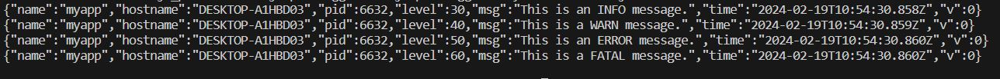
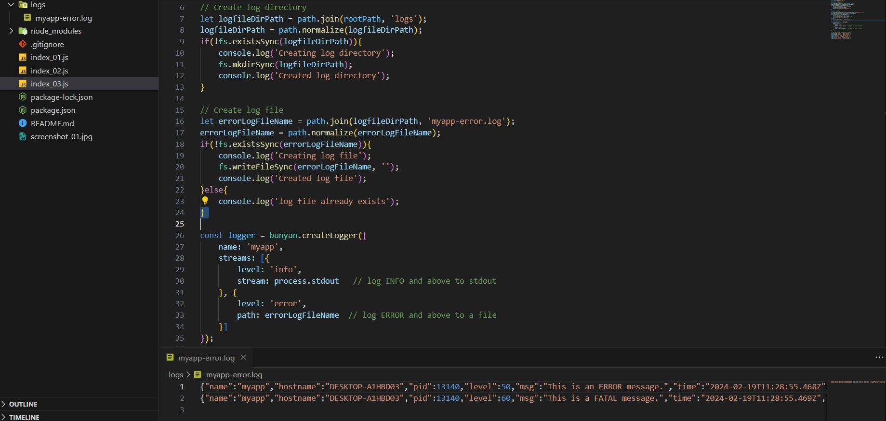

# Create Node Prject:
    mkdir nodejs-poc-logger-bunyan
    cd nodejs-poc-logger-bunyan
    npm init

# Install log4js dependencies:
    npm install bunyan

- example reference:

    https://github.com/trentm/node-bunyan?tab=readme-ov-file

    

- index_02.js

- index_03.js

