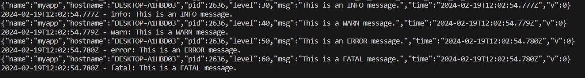
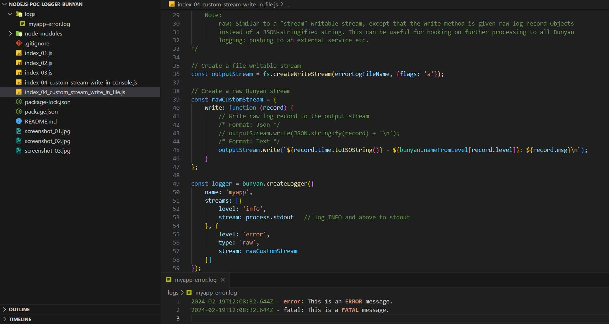
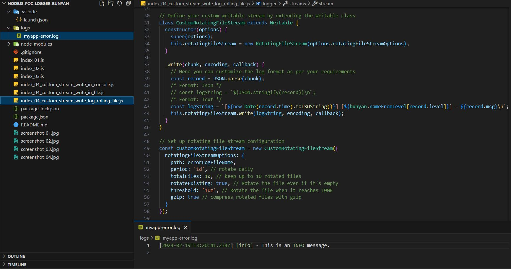

# Create Node Prject:
    mkdir nodejs-poc-logger-bunyan
    cd nodejs-poc-logger-bunyan
    npm init

# Install log4js dependencies:
    npm install bunyan
    npm install bunyan-rotating-file-stream
    
- example reference:

    https://github.com/trentm/node-bunyan?tab=readme-ov-file

    

- index_02.js

- index_03.js

- index_04_custom_stream_write_in_console.js

- index_04_custom_stream_write_in_file.js

- index_04_custom_stream_write_log_rolling_file.js

